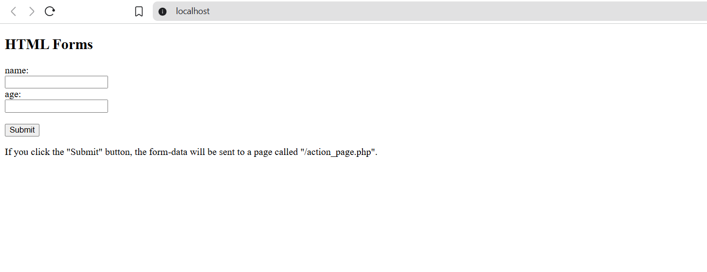
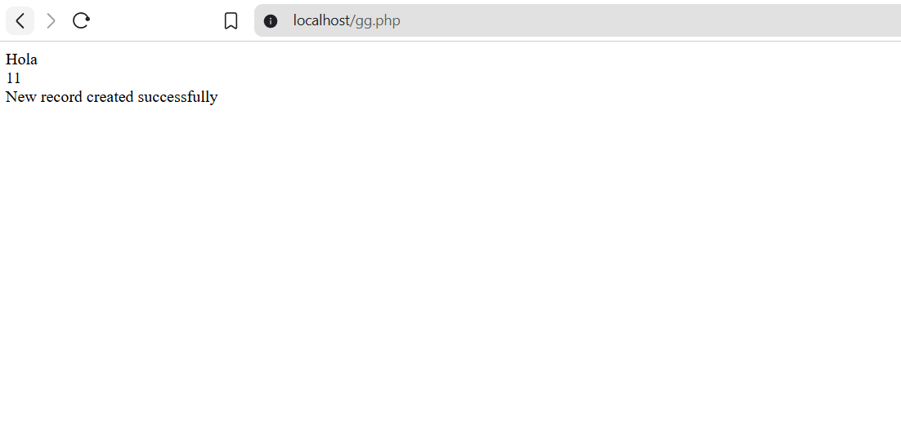
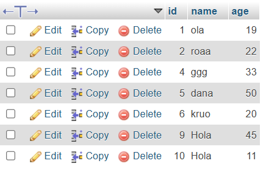

#  Web Form Data Collection with PHP & MySQL
This project is a simple web application that allows users to enter their name and age through an HTML form. Once submitted, the data is processed using PHP and stored in a MySQL database. The project is designed to run locally using the XAMPP environment.

##  Technologies Used
- **HTML** 
- **PHP**
- **MySQL** 
- **XAMPP** – Local server environment (Apache + MySQL)
- 

##  How the Result Looks Like

###  1. Form Preview 

###  2. Submission Result  

###  3. Database Records  

